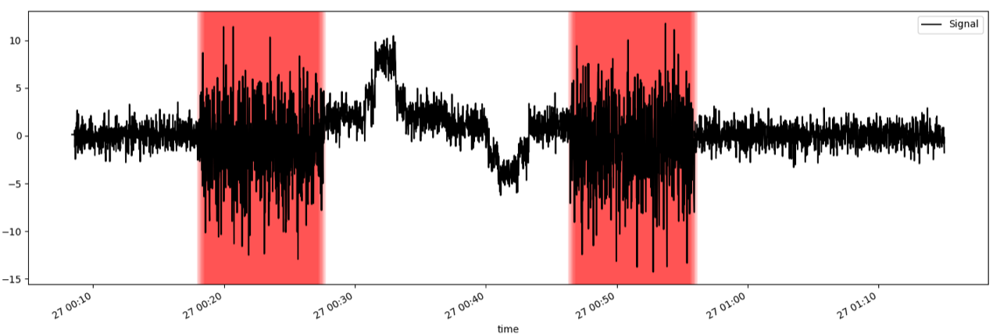

# Analisi della skewness di una serie temporale

## Introduzione



Il progetto consiste, dato un file rrd, nel determinare i punti in cui la serie temporale assume dei valori che ne aumentano la skewness. Come definizione di _skewness_ ho considerato quella riportata alla pagina [Skewness](https://en.wikipedia.org/wiki/Skewness). La formula usata è quella proposta al seguente [link](https://en.wikipedia.org/wiki/Skewness#Sample_skewness), cioè:


La formula viene applicata ad un intervallo di valori di ampiezza `size` punti e l'intervallo viene traslato di `transl` punti dopo ogni computazione del valore di skewness.

Il progetto si compone di alcuni script bash e di un programma C. Gli script sono usati per generare i file rrd da esaminare. In particolare `create_rrd.sh` crea un file rrd e lo riempie di punti con due possibili serie di dati seguendo uno tra due pattern prestabiliti, in base all'input 0 o 1; `network_rrd.sh` invece aggiunge punti al file rrd sulla base dei byte ricevuti dall'interfaccia di rete in tempo reale (`graph_rrd.sh` genera un grafico aggiornato ogni 5 secondi).
Il programma C, dato il path al file rrd da analizzare, si occupa di riportare un intervallo di tempo in cui la skewness della serie temporale supera una certa soglia, oltre ai valori di massima e minima skewness registrate in quell'intervallo. In particolare i parametri presi in input dal programma C sono:
- il tempo di inizio e di fine di analisi del file rrd
- l'ampiezza `size` dell'intervallo
- il numero di punti `transl` di cui traslare l'intervallo
- la soglia oltre cui riportare i valori di skewness calcolati
- il path al file rrd da analizzare

## Compilazione ed esecuzione

L'unica dipendenza è la libreria [librrd](https://github.com/oetiker/rrdtool-1.x), usata per accedere ai file rrd. Per la compilazione basta eseguire il comando `make`. Per l'esecuzione è sufficiente:
```
./skewness -f <path-to-rrd>
```
Un esempio di esecuzione potrebbe essere:
```
./scripts/create_rrs.sh 1
./skewness -t 90 -n 15 -T 3 -f skeweddata.rrd
```
Eseguendo questi comandi e osservando il grafico associato (in `skeweddata.png`) si nota che vengono evidenziati solo l'inizio e la fine dei primi due momenti di skewness, mentre l'ultimo non viene rilevato. Il primo comportamento si spiega perché la formula usata rileva momenti in cui la serie temporale ha un andamento improvvisamente più nervoso che si discosta dall'andamento che aveva avuto fino ad allora: i punti centrali degli intervalli di skewness non vengono rilevati perché ormai la serie temporale si è "stabilizzata" su quei valori (i comportamenti generati dallo script `create_rrd.sh` sono abbastanza regolari). Il secondo comportamento, nell'ultimo intervallo di skewness, credo sia dovuto al fatto che i punti skew hanno la stessa media dei punti negli intervalli non skew. Per rilevare skewness anche nell'ultimo intervallo si può abbassare il valore di soglia usato, ad esempio `-t 30`.

## Test

Il progetto è stato testato con diversi valori per i parametri `size` e `transl`. In particolare, all'aumentare di `size`, aumenta anche il valore assoluto dei valori di skewness calcolati. Il parametro di soglia è specifico per ogni file rrd: è stato scelto un valore di default di 100, ma in base a quanto la serie temporale è skew, al valore assoluto dei punti che appartengono al file rrd e a quali valori si scelgono per `size` e `transl` potrebbe essere necessario modificare il valore di soglia.

I test fatti usando il file rrd generato e aggiornato continuamente dallo script `network_rrd.sh` sono stati più interessanti, in quanto si basavano su dati reali e quindi su andamenti più realistici di quelli generati dagli script. Dopo aver avviato lo script (e opzionalmente averne generato il grafico con `./scripts/graph_rrd.sh`) con il comando
```
./scripts/network_rrd.sh
```
ho provato a avviare e fermare un video su youtube ed eseguendo
```
./skewness -t 100000000000000000 -f networkdata.rrd
```
venivano rilevati degli intervalli di skewness nel momenti in cui era stato riprodotto il video.
